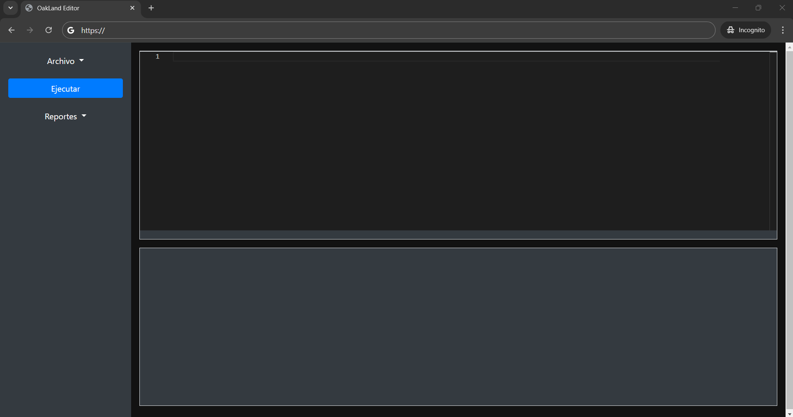
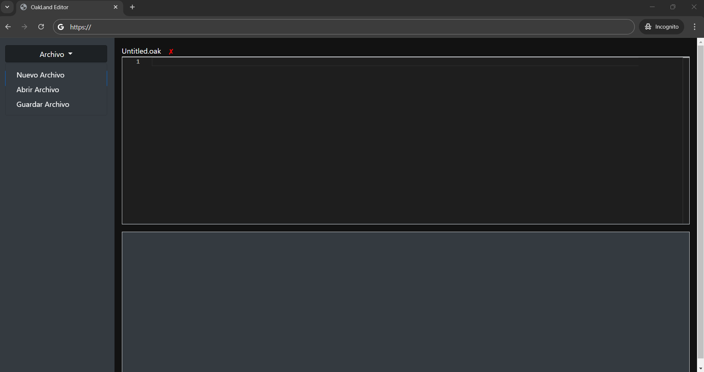
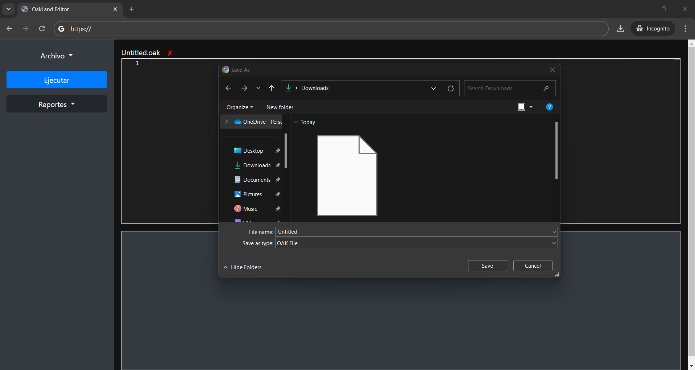
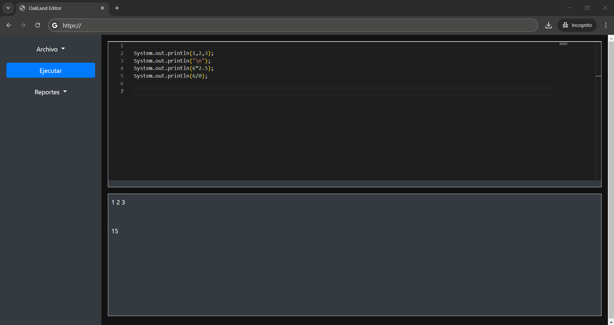
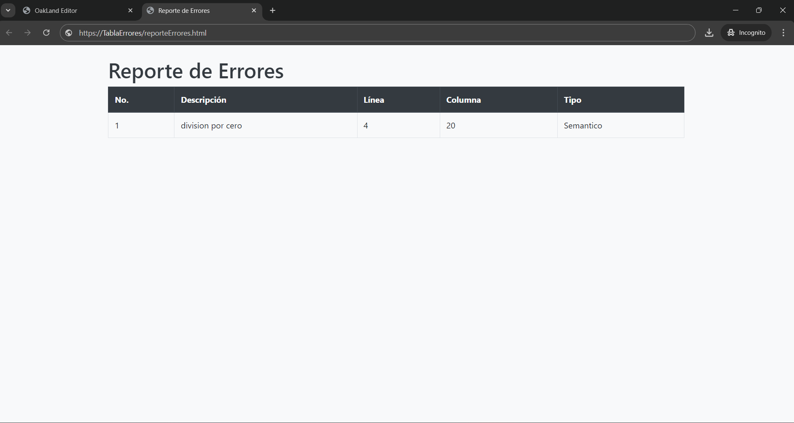
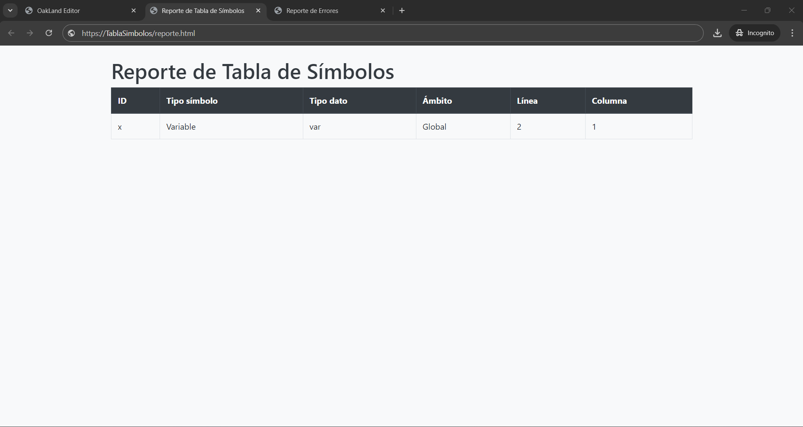

<h1 align="center">Proyecto 01</h1>

📕 Organizacion de Lenguajes y computadoras 2

 🏛 Universidad San Carlos de Guatemala

 📆 Segundo Semestre 2024

---
### MANUAL TECNICO
## Introducción
El Editor OakLand es una herramienta interactiva para escribir, ejecutar y depurar código en el lenguaje de programación OakLand. Este manual está diseñado para guiarte a través de las funciones principales del editor, desde la creación de archivos hasta la ejecución del código y la generación de reportes.

## Requisitos del Sistema
- **Navegador Web:** Compatible con las últimas versiones de Chrome, Firefox, Edge, y Safari.
- **Conexión a Internet:** Necesaria para el acceso y despliegue en GitHub Pages.

## Iniciando el Editor
1. **Abrir el Editor:** Accede a la URL del editor en tu navegador.
   
2. **Interfaz Principal:**
   - La interfaz se divide en tres áreas principales: la barra lateral, el área del editor con pestañas, y la consola de salida.
   -  <!-- Ref para agregar imagen de la interfaz principal -->

## Funcionalidades Principales

### 1. Manejo de Archivos
- **Crear Nuevo Archivo:**
  - Haz clic en el botón **"Archivo"** en la barra lateral y selecciona **"Nuevo Archivo"** para crear una nueva pestaña en el editor.
  -  
- **Abrir Archivo Existente:**
  - Selecciona **"Abrir Archivo"** desde el menú **"Archivo"** y elige uno o varios archivos `.oak` desde tu computadora.
  - Los archivos seleccionados se cargarán en nuevas pestañas dentro del editor.
  -  

- **Guardar Archivo:**
  - Para guardar cambios, selecciona **"Guardar Archivo"** en el menú **"Archivo"**. El archivo se descargará automáticamente a tu computadora.
  -  

### 2. Ejecución de Código
- **Ejecutar Código:**
  - Haz clic en el botón **"Ejecutar"** en la barra lateral para ejecutar el código actualmente visible en el editor.
  - Los resultados y mensajes de error se mostrarán en la consola ubicada debajo del editor.
  -  

### 3. Generación de Reportes
- **Reporte de Errores:**
  - Genera un reporte detallado de los errores léxicos, sintácticos y semánticos detectados durante la ejecución.
  - Accede a esta función desde el menú **"Reportes"** en la barra lateral y selecciona **"Reporte de Errores"**.
  -  

- **Tabla de Símbolos:**
  - Muestra un reporte de la tabla de símbolos, incluyendo variables, funciones, y sus respectivos tipos y ámbitos.
  - Selecciona **"Tabla de Símbolos"** desde el menú **"Reportes"**.
  -  

## Navegación y Uso de Pestañas
- Las pestañas permiten trabajar con múltiples archivos simultáneamente.
- Puedes cambiar entre pestañas haciendo clic en la pestaña correspondiente.
- Para cerrar una pestaña, haz clic en el botón de cierre en la esquina de la pestaña.

---